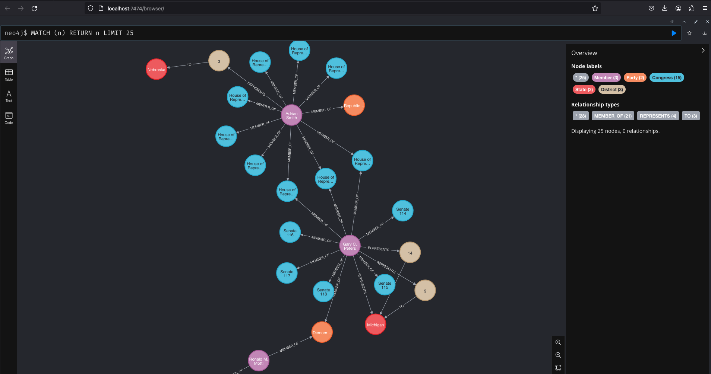

# Graph on Congress

The goal to create a directed graph using information on the United States Congress. Nodes of the graph will be entities (ex. Congressional members, bills, committees) and edges of the graph will be relationships. Once created, we will use [PyTorch-BigGraph (PBG)](https://github.com/facebookresearch/PyTorch-BigGraph) to learn embeddings of the entities.

## Set Up

### Python Environment

We suggest the use of a [Python virtual environment](https://docs.python.org/3/library/venv.html) to install the required libraries. Once a virtual environment is setup and activated, you can install the required libraries by running `pip install -r requirements.txt` in the root directory of the project.

### Environment Variables

To create your environment file, please copy the *.env.example* file and re-name it to *.env*. You can run `cp .env.example .env` in the root directory of the project to do so. You will then need to fill out the variables with the necessary information.

You will need to [sign up for an API key](https://api.congress.gov/sign-up/) to access the Congress.gov API.

### Docker Desktop

We suggest using Docker for running a containerized version of the graph database. You wil need to install [Docker Desktop](https://docs.docker.com/desktop/) to run the Neo4j container.

## Instructions

To run the Neo4j container, you can run the `make` command `make neo_up`. To stop the Neo4j container, you can use the command `make neo_down`.

## Congress.gov

[Congress.gov](https://www.congress.gov/) is the government website that provides the public with a way to search and read information produced by the U.S Congress. They have begun creating their own API, [Congress.gov API](https://api.congress.gov/), to improve the ingestion of Congressional data.

## Entities (Nodes)

- Congressional members
- Party
- Congress and Chamber
- Bills
- Committees
- Amendments
- State
- District

## Relationships (Edges)

- Vote Yay (Congressional member to Bill)
- Vote Nah (Congressional member to Bill)
- Member Of (Congressional member to Party, Committee, Congress and Chamber)
- Sponsor (Congressional member to Bill)
- Cosponsor (Congressional member to Bill)
- Represent (Congressional member to State, District)
- In (District to State)

## Stored the Graph

[neo4j](https://neo4j.com/) is a native graph database that can be used to effectively store and query graph data.

## Possible Future Features

To extend the information within the graph, a node set for Topics or Subjects (relating to politics and government) could be added to give bills more information about the actual content they hold and the positions they support.

## Information

[Neo4j Bolt driver for Python](https://pypi.org/project/neo4j/5.16.0/)

[Neo4j Docker image](https://hub.docker.com/_/neo4j)

[Neo4j Cypher Cheat Sheet](https://neo4j.com/docs/cypher-cheat-sheet/5/neo4j-community)

[Roll Call Votes by the U.S Congress](https://www.congress.gov/roll-call-votes)

